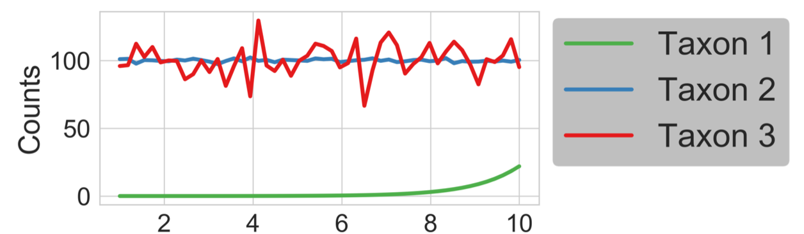
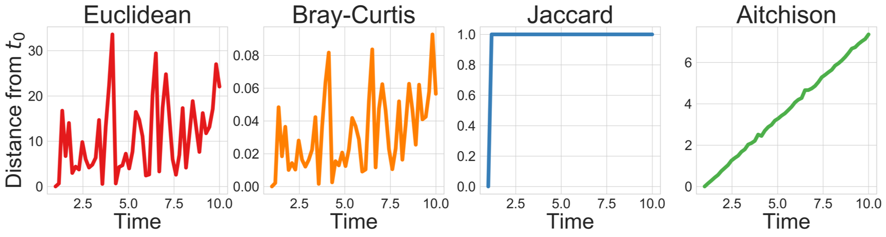

# Tutorial 

**Note**: This guide assumes you have installed QIIME 2 using one of the procedures in the [install documents](https://docs.qiime2.org/2019.1/install/) and have installed [q2-deicode](https://library.qiime2.org/plugins/q2-deicode).


## Introduction 

In this tutorial you will learn how to interpret and perform Robust Aitchison PCA through QIIME 2. The focus of this tutorial is compositional beta diversity. There are many beta diversity metrics that have been proposed, all with varying benefits on varying data structures. However, presence/absence metric often prove to give better results than those that rely on abundances (i.e. unweighted vs. weighted UniFrac). One component of this phenomenon is the interpretation of relative abundances can provide spurious results (see [the differential abundance analysis introduction](https://docs.qiime2.org/2019.1/tutorials/gneiss/). One solution to this problem is to use a compositional distance metric such as Aitchison distance. 


As a toy example let’s build three taxa. These three taxa represent common distributions we see in microbiome datasets. Where the first taxon is increasing exponentially across samples, this is a trend that we would be interested in. However, taxon 2 and 3 have much higher counts and taxon 3 is randomly fluctuating across samples.  



In our distances below we have Euclidean, Bray-Curtis, Jaccard, and Aitchison distances (from left to right). We can see that the abundance based metrics Euclidean and Bray-Curtis are heavily influenced by the abundance of taxon 3 and seem to randomly fluctuate. In the presence/absence metric, Jaccard, we see that the distance saturates to one very quickly. However, in the Aitchison distance we see a linear curve representing taxon 1. The reason the distance is linear is because Aitchison distance relies on log transforms (the log of an exponential taxon 1 is linear). 





From this toy example, it is clear that Aitchison distance better accounts for the proportions. However, we made the unrealistic assumption in our toy example that there were no zero counts. In real microbiome datasets there are a large number of zeros (i.e. sparsity). Sparsity complicates log ratio transformations because the log-ratio of zero is undefined. To solve this pseudo counts, that can skew results, are commonly used (see [Naught all zeros in sequence count data are the same](https://www.biorxiv.org/content/10.1101/477794v1)). 

Robust Aitchison PCA solves this problem in two steps:

1.	Compostional preprocessing using the centered log ratio transform on only the non-zero values of the data (no pseudo count)
2.	Dimensionality reduction through PCA on only the non-zero values of the data (via [SVD]( https://en.wikipedia.org/wiki/Singular_value_decomposition) by [matrix completion]( https://arxiv.org/pdf/0906.2027.pdf)). 

To demonstrate this in action we will run an example dataset below, where the output can be viewed as a compositional biplot through emperor. 

## Example 

In this example we will Robust Aitchison PCA via q2-deicode on a study of sleep apnea published in [Tripathi et al. (2018)](https://msystems.asm.org/content/3/3/e00020-18). The study consists of mouse fecal samples and focuses on comparing the gut microbiome of animals exposed to intermittent hypoxia and hypercapnia (IHH; as a model of obstructive sleep apnea) to controls exposed to room air (air). 

Before beginning the tutorial let’s make a directory to store the data


```python
> mkdir qiime2-sleep-apnea-tutorial
> cd qiime2-sleep-apnea-tutorial
```


###### Table
**Download URL**:https://github.com/biocore/DEICODE/blob/master/ipynb/sleep_apnea/qiita_10422_table.biom.qza <br>
**save as:** qiita_10422_table.biom.qza <br>

###### Sample Metadata
**Download URL**: https://github.com/biocore/DEICODE/blob/master/ipynb/sleep_apnea/qiita_10422_metadata.tsv <br>
**save as:** qiita_10422_metadata.tsv <br>

###### Feature Metadata
**Download URL**: https://github.com/biocore/DEICODE/blob/master/ipynb/sleep_apnea/taxonomy.qza <br>
**save as:** taxonomy.qza <br>


Using qiita_10422_table.biom.qza, of the type raw count table (FeatureTable[Frequency]), we will generate our beta diversity ordination file using q2-deicode. There are a few parameters to deicode that we may want to consider. The first are sample filtering cutoffs these are  p-min-feature-count and p-min-sample-count. Both of these parameters accept integer values and remove feature or samples, respectively, with sums below this cutoff. The feature cut-off is useful in the case that features with very low total counts among all samples represent contamination or chimeric sequences. The sample cut off is useful for the case that some sample received very few reads relative to other samples.

**Note:** it _not_ recommended to bin your features by taxonomic assignment (i.e. by genus level). <br>
**Note:** it _not_ recommended to rarefy your data before using deicode. 

The other two parameters are --p-rank and --p-iterations. These parameters should rarely have to change from the default. However, the minimum value of --p-rank can be 1 and the maximum recommended value is 10. Similarly, the minimum value of --p-iterations is 1 and is recommended to be below 500.  

Now that we understand the acceptable parameters, we are ready to run deicode.  


```python
> qiime dev refresh-cache
```

    QIIME is caching your current deployment for improved performance. This may take a few moments and should only happen once per deployment.


```python
> qiime deicode rpca-biplot \
    --i-table qiita_10422_table.biom.qza \
    --p-min-feature-count 10 \
    --p-min-sample-count 500 \
    --o-biplot ordination.qza
```

    Saved PCoAResults % Properties(['biplot']) to: ordination.qza


Now that we have our ordination file, with type (PCoAResults % Properties(['biplot'])), we are ready to visualize the results. This can be done using emperor as a biplot. In this case we will include metadata for our features (optional) and our samples (required). 


```python
> qiime emperor biplot \
    --i-biplot ordination.qza \
    --m-sample-metadata-file qiita_10422_metadata.tsv \
    --m-feature-metadata-file taxonomy.qza \
    --o-visualization biplot.qzv \
    --p-number-of-features 8
```

    Saved Visualization to: biplot.qzv


The interpretation of the compositional biplot may differ from classical biplot interpretation (we can view the qzv file at [view.qiime2](https://view.qiime2.org). The important features with regard to sample clusters are not a single arrow but by the log ratio between features represented by arrows pointing in different directions. A visualization tool for these log ratios is coming soon to QIIME 2. 

