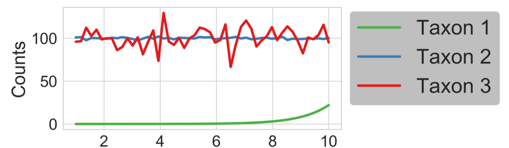
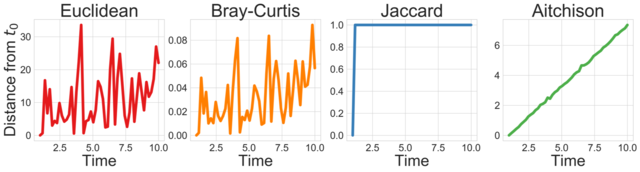
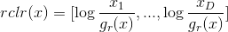
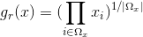
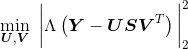
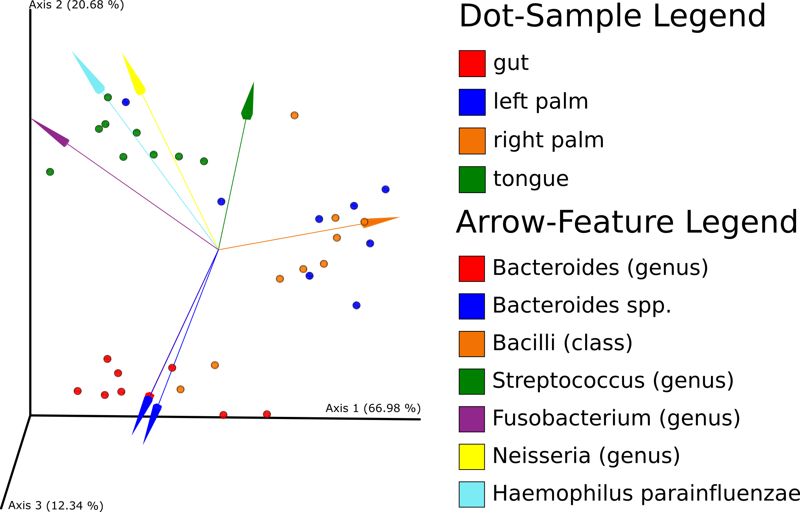
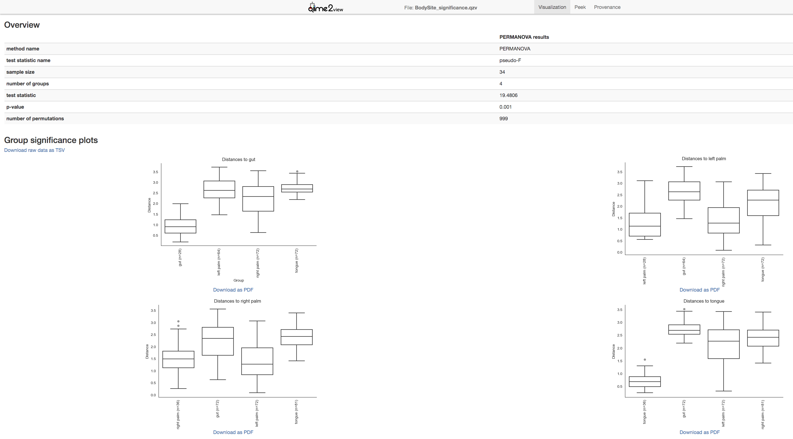

# DEICODE
(pronounced like decode /de.ko.de/) 
[Documentation available in the plugin library.](https://library.qiime2.org/plugins/deicode/19/)

DEICODE is a form of [Aitchison Distance](https://en.wikipedia.org/wiki/Aitchison_geometry) that is robust to high levels of sparsity. DEICODE utilizes a natural solution to the zero problem formulated in recommendation systems  called [matrix completion]( https://arxiv.org/pdf/0906.2027.pdf). A simple way to interpret the method is, as a robust compositional [PCA (via SVD)]( https://en.wikipedia.org/wiki/Principal_component_analysis) where zero values do not influence the resulting ordination. One of the benefits of using DEICODE is the ability to reveal salient inter-community niche feature importance in compositional biplots. These biplot can be easily visualized in the existing QIIME architecture through [Emperor](https://docs.qiime2.org/2018.11/plugins/available/emperor/).

# Installation within a QIIME Environment

If you have not already done so, activate your QIIME environment.
```
source activate qiime2-20xx.x
```

DEICODE is available for installation through pip _or_ conda:

```
pip install deicode
```
 
**Note**:  the conda install is only supported for Qiime>=2019.1
```
conda install -c conda-forge deicode
```

# Tutorial 
**Note**: This guide assumes you have installed QIIME using one of the procedures in the [install documents](https://docs.qiime2.org/2019.1/install/) and have installed [DEICODE](https://library.qiime2.org/plugins/q2-deicode).

## Introduction 

In this tutorial you will learn how to interpret and perform Robust Aitchison PCA through QIIME. The focus of this tutorial is compositional beta diversity. There are many beta diversity metrics that have been proposed, all with varying benefits on varying data structures. However, presence/absence metric often prove to give better results than those that rely on abundances (i.e. unweighted vs. weighted UniFrac). One component of this phenomenon is that the interpretation of relative abundances can provide spurious results (see [the differential abundance analysis introduction](https://docs.qiime2.org/2019.1/tutorials/gneiss/)). One solution to this problem is to use a compositional distance metric such as [Aitchison distance](https://en.wikipedia.org/wiki/Aitchison_geometry). 


As a toy example let’s build three taxa. These three taxa represent common distributions we see in microbiome datasets. Where the first taxon is increasing exponentially across samples, this is a trend that we would be interested in. However, taxon 2 and 3 have much higher counts and taxon 3 is randomly fluctuating across samples.  



In our distances below we have Euclidean, Bray-Curtis, Jaccard, and Aitchison distances (from left to right). We can see that the abundance based metrics Euclidean and Bray-Curtis are heavily influenced by the abundance of taxon 3 and seem to randomly fluctuate. In the presence/absence metric, Jaccard, we see that the distance saturates to one very quickly. However, in the Aitchison distance we see a linear curve representing taxon 1. The reason the distance is linear is because Aitchison distance relies on log transforms (the log of the exponential trend of taxon 1 is linear). 




From this toy example, it is clear that Aitchison distance better accounts for the proportions. However, we made the unrealistic assumption in our toy example that there were no zero counts. In real microbiome datasets there are a large number of zeros (i.e. sparsity). Sparsity complicates log ratio transformations because the log-ratio of zero is undefined. To solve this, pseudo counts are often used but that can often skew results (see [Naught all zeros in sequence count data are the same](https://www.biorxiv.org/content/10.1101/477794v1)). 

Robust Aitchison PCA solves this problem in two steps:

**1.** Compostional preprocessing using the centered log ratio transform on only the non-zero values of the data (no pseudo count)





**2.** Dimensionality reduction through Robust PCA on only the non-zero values of the data ( [matrix completion]( https://arxiv.org/pdf/0906.2027.pdf)). 



To demonstrate this in action we will run an example dataset below, where the output can be viewed as a compositional biplot through Emperor. 

## Example 

In this example we will use Robust Aitchison PCA via DEICODE on the “Moving Pictures” tutorial, if you have not yet completed the tutorial it can be found [here](https://docs.qiime2.org/2019.1/tutorials/moving-pictures/). The dataset consists of human microbiome samples from two individuals at four body sites at five timepoints, the first of which immediately followed antibiotic usage ([Caporaso et al. 2011](https://www.ncbi.nlm.nih.gov/pubmed/21624126)). If you have completed this tutorial run the following command and skip the download section.

```shell
cd qiime2-moving-pictures-tutorial
```

If you have skipped the tutorial but would like to get started quickly, the data files needed for the DEICODE tutorial must be downloaded below.  

```shell
mkdir qiime2-moving-pictures-tutorial
cd qiime2-moving-pictures-tutorial
```

##### Table [view](https://view.qiime2.org/?src=https%3A%2F%2Fdocs.qiime2.org%2F2019.1%2Fdata%2Ftutorials%2Fmoving-pictures%2Ftable.qza) | [download](https://docs.qiime2.org/2019.1/data/tutorials/moving-pictures/table.qza)
**save as:** table.qza 

##### Sample Metadata [download](https://data.qiime2.org/2019.1/tutorials/moving-pictures/sample_metadata.tsv)
**save as:** sample_metadata.tsv

##### Feature Metadata  [view](https://view.qiime2.org/?src=https%3A%2F%2Fdocs.qiime2.org%2F2019.1%2Fdata%2Ftutorials%2Fmoving-pictures%2Ftaxonomy.qza) | [download](https://docs.qiime2.org/2019.1/data/tutorials/moving-pictures/taxonomy.qza)
**save as:** taxonomy.qza

Using table.qza, of the type raw count table (FeatureTable[Frequency]), we will generate our beta diversity ordination file. There are a few parameters to DEICODE that we may want to consider. The first is filtering cutoffs, these are p-min-feature-count and p-min-sample-count. Both of these parameters accept integer values and remove feature or samples, respectively, with sums below this cutoff. The feature cut-off is useful in the case that features with very low total counts among all samples represent contamination or chimeric sequences. The sample cut off is useful for the case that some sample received very few reads relative to other samples.

**Note:** it is _not_ recommended to bin your features by taxonomic assignment (i.e. by genus level). 
**Note:** it is _not_ recommended to rarefy your data before using DEICODE. 

The other two parameters are --p-rank and --p-iterations. These parameters should rarely have to change from the default. However, the minimum value of --p-rank can be 1 and the maximum recommended value is 10. Similarly, the minimum value of --p-iterations is 1 and is recommended to be below 500.  

Now that we understand the acceptable parameters, we are ready to run DEICODE.  

```shell
 qiime dev refresh-cache
```

```shell
 qiime deicode rpca \
    --i-table table.qza \
    --p-min-feature-count 10 \
    --p-min-sample-count 500 \
    --o-biplot ordination.qza \
    --o-distance-matrix distance.qza
```
**Output:** PCoAResults % Properties(['biplot']) to: ordination.qza, DistanceMatrix to: distance.qza

Now that we have our ordination file, with type (PCoAResults % Properties(['biplot'])), we are ready to visualize the results. This can be done using the [Emperor](https://docs.qiime2.org/2019.1/plugins/available/emperor/) biplot functionality. In this case we will include metadata for our features (optional) and our samples (required). 

```shell
qiime emperor biplot \
    --i-biplot ordination.qza \
    --m-sample-metadata-file sample_metadata.tsv \
    --m-feature-metadata-file taxonomy.qza \
    --o-visualization biplot.qzv \
    --p-number-of-features 8
```
**Output:** biplot.qzv

Biplots are exploratory visualization tools that allow us to represent the features (i.e. taxonomy or OTUs)  that strongly influence the principal component axis as arrows. The interpretation of the compositional biplot differs slightly from classical biplot interpretation (we can view the qzv file at [view.qiime2](https://view.qiime2.org). The important features with regard to sample clusters are not a single arrow but by the log ratio between features represented by arrows pointing in different directions. A visualization tool for these log ratios is coming soon to QIIME. 



From this visualization we noticed that BodySite seems to explain the clusters well. We can run [PERMANOVA](https://docs.qiime2.org/2019.1/plugins/available/diversity/beta-group-significance/) on the distances to get a statistical significance for this. 

```shell
 qiime diversity beta-group-significance \
    --i-distance-matrix distance.qza \
    --m-metadata-file sample-metadata.tsv \
    --m-metadata-column BodySite \
    --p-method permanova \
    --o-visualization BodySite_significance.qzv
```

Indeed we can now see that the clusters we saw in the biplot were significant by viewing the BodySite_significance.qzv at [view.qiime2](https://view.qiime2.org).



## Citation 

C. Martino et al., A Novel Sparse Compositional Technique Reveals Microbial Perturbations. mSystems. 4 (2019), [doi:10.1128/mSystems.00016-19](doi:10.1128/mSystems.00016-19).


## Other Resources

[Documentation on GitHub](https://github.com/biocore/DEICODE)
The code for OptSpace was translated to python from a [MATLAB package](http://swoh.web.engr.illinois.edu/software/optspace/code.html) maintained by Sewoong Oh (UIUC).
